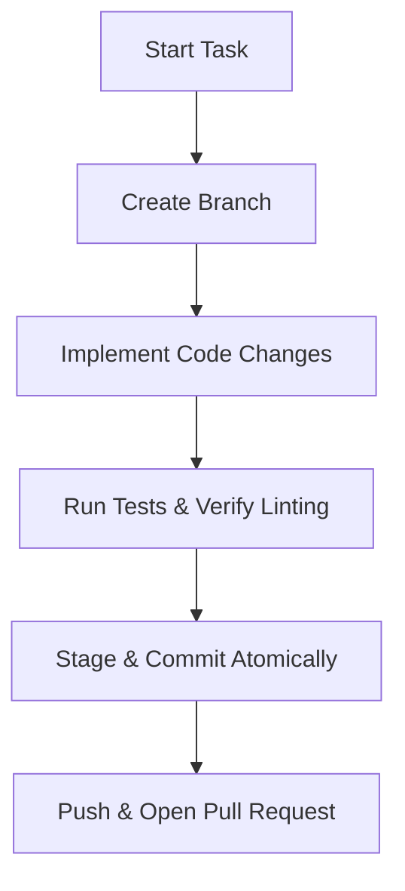

# Git Best Practices & Agent Workflow Guidelines

This document outlines the standard Git version control guidelines and operational instructions for all human and AI agents collaborating on the **PchClk** repository.

---

## 1. Branching Strategy

We follow a simplified Git Flow model to ensure the `main` branch remains clean, deployable, and stable.

### Branch Categories
- **`main`**: The production-ready branch. Direct commits to `main` are restricted, except for emergency hotfixes approved by the Lead Architect.
- **`feature/<component>-<topic>`**: For developing new features or refactorings (e.g., `feature/backend-jwt-auth`, `feature/frontend-qr-scanner`).
- **`bugfix/<component>-<topic>`**: For fixing identified issues or bugs (e.g., `bugfix/db-wal-lock-contention`, `bugfix/frontend-pwa-refresh`).
- **`hotfix/<topic>`**: Critical patches applied directly to production/staging issues.

---

## 2. Commit Message Convention

We strictly enforce the **Conventional Commits** specification (v1.0.0). This enables automated changelog generation and maintains a clean history.

### Commit Format
```text
<type>(<scope>): <description>

[optional body]

[optional footer(s)]
```

### Allowed Types
- **`feat`**: A new feature for the application (e.g., `feat(backend): implement quarterly hash rotation`).
- **`fix`**: A bug fix (e.g., `fix(frontend): repair IndexedDB fallback sync`).
- **`docs`**: Documentation-only changes (e.g., `docs(readme): add docker run instructions`).
- **`style`**: Changes that do not affect the meaning of the code (white-space, formatting, missing semi-colons, etc.).
- **`refactor`**: A code change that neither fixes a bug nor adds a feature.
- **`perf`**: A code change that improves performance.
- **`test`**: Adding missing tests or correcting existing tests.
- **`chore`**: Updates to build tasks, package manager configs, or internal tools (no production code change).

### Example Commits
```text
feat(backend): add SQLite audit log trigger middleware
- Intercepts and records affected rows on admin queries.
- Stores UTC timestamp, admin user ID, and action signature.
```

---

## 3. Step-by-Step Agent Git Workflow

When developing, AI agents must follow this sequential loop:



### Step 3.1: Create a Topic Branch
Before making changes, verify your starting point and create a dedicated branch:
```bash
git checkout main
git pull origin main
git checkout -b feature/backend-migration-script
```

### Step 3.2: Write Atomic Commits
- Do not combine backend database migrations and frontend component updates in the same commit.
- Keep changes concise. If a feature has multiple sub-tasks, commit them sequentially.

### Step 3.3: Verification Before Staging
Before executing `git add`, run verification checks:
- Ensure the API compiles and runs locally.
- Run unit/integration tests (`npm test` in the respective directories).
- Verify styling/linting rules are met.

### Step 3.4: Staging and Committing
Stage only the relevant files:
```bash
git add backend/src/db/migrations/
git commit -m "feat(backend): create SQLite tables for employees and logs"
```

---

## 4. Conflict Resolution & Hygiene

- **Rebase over Merge**: Agents should prefer rebasing their feature branches onto `main` to maintain a flat, linear history:
  ```bash
  git fetch origin
  git rebase origin/main
  ```
- **Cleanup**: Always delete local and remote feature branches once they have been successfully merged into `main`.
